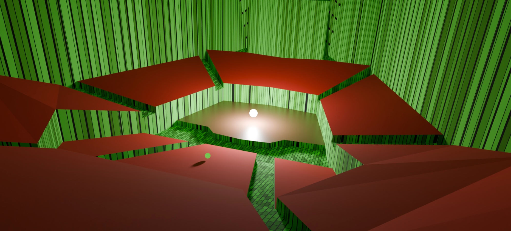

# misuka Blender

This add-on extends the Mitsuba Blender add-on with support for misuka-based geometric acoustic simulation and acoustic scene export.

## Main Features

- **Acoustic scene export**: Export Blender scenes as misuka-compatible acoustic XML scenes.

- **Acoustic Mode**: Automatically replaces visual Mitsuba components with acoustic equivalents during export:

  - `path` → `acoustic_path`
  - `perspective` → `microphone`
  - `hdrfilm` → `tape`
  - point lights → sphere + area emitters
  - `principled_bsdf` → `acousticbsdf`

- **Acoustic material workflow**:

  - frequency-dependent absorption and scattering
  - adjustable specular lobe width
  - octave-band editing inside Blender
  - interpolation and reset utilities
  - manual material input

- **AcousticIndex integration**:

  - API-based material lookup
  - automatic download of absorption/scattering data
  - third-octave to octave conversion
  - interpolation of incomplete datasets

- **Coordinate consistency**:
  Blender and misuka coordinates match by default (`Y Forward`, `Z Up`).

## Installation

- Download the latest ZIP archive from the GitHub Releases page.
- In Blender, go to **Edit** -> **Preferences** -> **Add-ons** -> **Install**.
- Select the downloaded ZIP archive.
- Enable the add-on.
- In the add-on preferences:
  - enable *Use custom misuka path*
  - select the misuka build directory
  - optionally enter an AcousticIndex API key

**Note:** if you use a custom misuka path, that build must have been compiled
against the same Python version as Blender's bundled Python interpreter (e.g.
Python 3.11 for Blender 4.2) — the native extension modules are ABI-locked to
a specific Python minor version and will fail to import otherwise.

## Requirements

- Blender `3.6+`
- misuka build with acoustic plugins enabled

## Development status

This project was originally developed by Julius Schwarz, and has since been
updated for compatibility with misuka v0.1.0.
